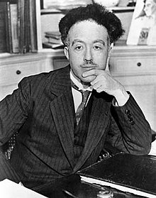

<table class="infobox biography vcard">
<tbody>
<tr>
<th colspan="2">

Louis de Broglie

</th>
</tr>
<tr>
<td colspan="2">

Broglie in 1929

</td>
</tr>
<tr>
<th scope="row">Born</th>
<td>15 August 1892 

<a class="mw-redirect" title="Dieppe, France" href="https://en.wikipedia.org/wiki/Dieppe,_France">Dieppe</a>, France

</td>
</tr>
<tr>
<th scope="row">Died</th>
<td>19 March 1987&nbsp;(aged&nbsp;94) 

<a title="Louveciennes" href="https://en.wikipedia.org/wiki/Louveciennes">Louveciennes</a>, France

</td>
</tr>
<tr>
<th scope="row">Nationality</th>
<td class="category">French</td>
</tr>
<tr>
<th scope="row">Alma&nbsp;mater</th>
<td><a title="University of Paris" href="https://en.wikipedia.org/wiki/University_of_Paris">University of Paris</a> (&Beta;&Alpha; in History, 1910; BA in Sciences, 1913; PhD in physics, 1924)</td>
</tr>
<tr>
<th scope="row">Known&nbsp;for</th>
<td>Wave nature of&nbsp;<a class="mw-redirect" title="Electrons" href="https://en.wikipedia.org/wiki/Electrons">electrons</a> <a title="De Broglie&ndash;Bohm theory" href="https://en.wikipedia.org/wiki/De_Broglie%E2%80%93Bohm_theory">De Broglie&ndash;Bohm theory</a> <a title="Matter wave" href="https://en.wikipedia.org/wiki/Matter_wave">de Broglie wavelength</a></td>
</tr>
<tr>
<th scope="row">Awards</th>
<td><a title="Nobel Prize in Physics" href="https://en.wikipedia.org/wiki/Nobel_Prize_in_Physics">Nobel Prize in Physics</a>&nbsp;(1929) <a class="new" title="Henri Poincar&eacute; Medal (page does not exist)" href="https://en.wikipedia.org/w/index.php?title=Henri_Poincar%C3%A9_Medal&amp;action=edit&amp;redlink=1">Henri Poincar&eacute; Medal</a>&nbsp;(1929) <a class="new" title="Albert I of Monaco Prize (page does not exist)" href="https://en.wikipedia.org/w/index.php?title=Albert_I_of_Monaco_Prize&amp;action=edit&amp;redlink=1">Albert I of Monaco Prize</a>&nbsp;(1932) <a title="Max Planck Medal" href="https://en.wikipedia.org/wiki/Max_Planck_Medal">Max Planck Medal</a>&nbsp;(1938) <a title="Kalinga Prize" href="https://en.wikipedia.org/wiki/Kalinga_Prize">Kalinga Prize</a>&nbsp;(1952)</td>
</tr>
<tr>
<td colspan="2"><strong>Scientific career</strong></td>
</tr>
<tr>
<th scope="row">Fields</th>
<td class="category"><a title="Physics" href="https://en.wikipedia.org/wiki/Physics">Physics</a></td>
</tr>
<tr>
<th scope="row">Institutions</th>
<td><a title="University of Paris" href="https://en.wikipedia.org/wiki/University_of_Paris">University of Paris</a>&nbsp;(Sorbonne)</td>
</tr>
<tr>
<th scope="row"><a title="Thesis" href="https://en.wikipedia.org/wiki/Thesis">Thesis</a></th>
<td><a class="external text" href="https://tel.archives-ouvertes.fr/tel-00006807" rel="nofollow"><em>Recherches sur la th&eacute;orie des quanta("Research on Quantum Theory")</em></a>&nbsp;(1924)</td>
</tr>
<tr>
<th scope="row"><a title="Doctoral advisor" href="https://en.wikipedia.org/wiki/Doctoral_advisor">Doctoral advisor</a></th>
<td><a title="Paul Langevin" href="https://en.wikipedia.org/wiki/Paul_Langevin">Paul Langevin</a></td>
</tr>
<tr>
<th scope="row">Doctoral students</th>
<td><a title="C&eacute;cile DeWitt-Morette" href="https://en.wikipedia.org/wiki/C%C3%A9cile_DeWitt-Morette">C&eacute;cile DeWitt-Morette</a> <a title="Bernard d'Espagnat" href="https://en.wikipedia.org/wiki/Bernard_d%27Espagnat">Bernard d'Espagnat</a> <a title="Jean-Pierre Vigier" href="https://en.wikipedia.org/wiki/Jean-Pierre_Vigier">Jean-Pierre Vigier</a> <a title="Alexandru Proca" href="https://en.wikipedia.org/wiki/Alexandru_Proca">Alexandru Proca</a> <a title="Marie-Antoinette Tonnelat" href="https://en.wikipedia.org/wiki/Marie-Antoinette_Tonnelat">Marie-Antoinette Tonnelat</a></td>
</tr>
</tbody>
</table>
 

<strong>Louis Victor Pierre Raymond de Broglie, 7th duc de Broglie</strong>&nbsp;(15 August 1892 &ndash; 19 March 1987)&nbsp;was a French&nbsp;<a title="Physicist" href="https://en.wikipedia.org/wiki/Physicist">physicist</a>&nbsp;and aristocrat who made groundbreaking contributions to&nbsp;<a title="Old quantum theory" href="https://en.wikipedia.org/wiki/Old_quantum_theory">quantum theory</a>. In his 1924 PhD thesis, he postulated the wave nature of&nbsp;<a class="mw-redirect" title="Electrons" href="https://en.wikipedia.org/wiki/Electrons">electrons</a>&nbsp;and suggested that&nbsp;<a title="Matter wave" href="https://en.wikipedia.org/wiki/Matter_wave">all matter has wave properties</a>. This concept is known as the de Broglie hypothesis, an example of&nbsp;<a title="Wave&ndash;particle duality" href="https://en.wikipedia.org/wiki/Wave%E2%80%93particle_duality">wave&ndash;particle duality</a>, and forms a central part of the theory of&nbsp;<a title="Quantum mechanics" href="https://en.wikipedia.org/wiki/Quantum_mechanics">quantum mechanics</a>.

De Broglie won the&nbsp;<a class="mw-redirect" title="Nobel Prize for Physics" href="https://en.wikipedia.org/wiki/Nobel_Prize_for_Physics">Nobel Prize for Physics</a>&nbsp;in 1929, after the wave-like behaviour of matter was&nbsp;<a title="Davisson&ndash;Germer experiment" href="https://en.wikipedia.org/wiki/Davisson%E2%80%93Germer_experiment">first experimentally demonstrated</a>&nbsp;in 1927.

The 1925&nbsp;<a class="mw-redirect" title="Pilot-wave" href="https://en.wikipedia.org/wiki/Pilot-wave">pilot-wave</a>&nbsp;model,&nbsp;and the wave-like behaviour of particles discovered by de Broglie was used by&nbsp;<a title="Erwin Schr&ouml;dinger" href="https://en.wikipedia.org/wiki/Erwin_Schr%C3%B6dinger">Erwin Schr&ouml;dinger</a>&nbsp;in his formulation of&nbsp;<a title="Schr&ouml;dinger equation" href="https://en.wikipedia.org/wiki/Schr%C3%B6dinger_equation">wave mechanics</a>.&nbsp;The pilot-wave model and interpretation was then abandoned, in favor of the&nbsp;<a title="Copenhagen interpretation" href="https://en.wikipedia.org/wiki/Copenhagen_interpretation">quantum formalism</a>, until 1952 when it was&nbsp;<a title="De Broglie&ndash;Bohm theory" href="https://en.wikipedia.org/wiki/De_Broglie%E2%80%93Bohm_theory">rediscovered and enhanced by David Bohm</a>.

Louis de Broglie was the sixteenth member elected to occupy&nbsp;<a title="List of members of the Acad&eacute;mie fran&ccedil;aise" href="https://en.wikipedia.org/wiki/List_of_members_of_the_Acad%C3%A9mie_fran%C3%A7aise#Seat_1">seat 1</a>&nbsp;of the&nbsp;<a class="mw-redirect" title="Acad&eacute;mie fran&ccedil;aise" href="https://en.wikipedia.org/wiki/Acad%C3%A9mie_fran%C3%A7aise">Acad&eacute;mie fran&ccedil;aise</a>&nbsp;in 1944, and served as Perpetual Secretary of the&nbsp;<a title="French Academy of Sciences" href="https://en.wikipedia.org/wiki/French_Academy_of_Sciences">French Academy of Sciences</a>.&nbsp;De Broglie became the first high-level scientist to call for establishment of a multi-national laboratory, a proposal that led to the establishment of the European Organization for Nuclear Research (<a title="CERN" href="https://en.wikipedia.org/wiki/CERN">CERN</a>).

 

<strong> Publications: </strong>

<ul>

 <li><a target="_blank" href="https://github.com/manjunath5496/Louis-de-Broglie-Papers/blob/master/tst(196).pdf" style="text-decoration:none;">The Interpretation of Wave Mechanics with the help of Waves with Singular Regions</a></li>
                            
 <li><a target="_blank" href="https://github.com/manjunath5496/Louis-de-Broglie-Papers/blob/master/tst(197).pdf" style="text-decoration:none;">The wave nature of the electron [Nobel Lecture]</a></li>
 
  <li><a target="_blank" href="https://github.com/manjunath5496/Louis-de-Broglie-Papers/blob/master/tst(198).pdf" style="text-decoration:none;">An Introduction To The Study Of Wave Mechanics</a></li>
 
  <li><a target="_blank" href="https://github.com/manjunath5496/Louis-de-Broglie-Papers/blob/master/tst(199).pdf" style="text-decoration:none;">Matter and Light: The New Physics</a></li>
  
<li><a target="_blank" href="https://github.com/manjunath5496/Louis-de-Broglie-Papers/blob/master/tst(200).pdf" style="text-decoration:none;"> Waves and Quanta </a></li> 
</ul>
 
